# Case Study: Foodie-Fi
### Data Analysis Solutions

1. **How many customers has Foodie-Fi ever had?**
    ```sql
    -- Counting the distinct customer IDs
    SELECT COUNT(DISTINCT customer_id) AS customers
    FROM subscriptions;
    ```
 Explanation: This query counts the total number of unique customers who have ever subscribed to Foodie-Fi.
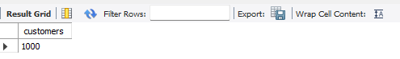

2. **What is the monthly distribution of trial plan start_date values for our dataset?**
    ```sql
    -- Selecting the start of the month and the count of distinct customer IDs
    SELECT 
        DATE_FORMAT(s.start_date, '%Y-%m-01') AS start_of_month, 
        COUNT(DISTINCT s.customer_id) AS customer_count
    FROM subscriptions s
    JOIN plans p ON p.plan_id = s.plan_id
    WHERE p.plan_name = 'trial'
    GROUP BY DATE_FORMAT(s.start_date, '%Y-%m-01');
    ```
Explanation: This query calculates the monthly distribution of trial plan start_date values, grouping them by the start of each month.
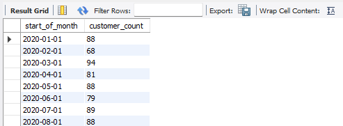

3. **What plan start_date values occur after the year 2020 for our dataset?**
    ```sql
    -- Selecting the plan_name and the count of events for each plan_name
    SELECT 
        p.plan_name, 
        COUNT(*) AS event_count
    FROM subscriptions s
    JOIN plans p ON p.plan_id = s.plan_id
    WHERE YEAR(s.start_date) > 2020
    GROUP BY p.plan_name;
    ```
Explanation: This query shows the breakdown of plan start_date values occurring after the year 2020 for each plan_name.
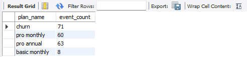

4. **What is the customer count and percentage of customers who have churned?**
    ```sql
    -- Selecting the rounded customer count and percentage of customers who have churned
    SELECT 
        ROUND(COUNT(DISTINCT s.customer_id), 1) AS customer_count,
        ROUND((COUNT(DISTINCT s.customer_id) / (SELECT COUNT(DISTINCT customer_id) FROM subscriptions) * 100), 1) AS percentage_churned
    FROM subscriptions s
    JOIN plans p ON p.plan_id = s.plan_id
    WHERE p.plan_name = 'churn';
    ```
 Explanation: This query calculates the total number and percentage of customers who have churned.
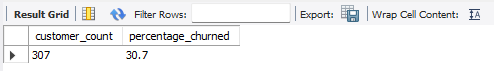

5. **How many customers have churned straight after their initial free trial?**
    ```sql
    -- Selecting the count and percentage of customers who have churned straight after their initial free trial
    WITH cte_churn AS (
        SELECT *, LAG(plan_id,1) OVER(PARTITION BY customer_id ORDER BY plan_id )AS prev_plan
        FROM subscriptions )
    SELECT ROUND(COUNT((prev_plan)),0) AS churn_count , ROUND(COUNT(prev_plan)/ (SELECT COUNT(DISTINCT(customer_id)) FROM subscriptions)*100, 0) AS percent
    FROM cte_churn
    WHERE plan_id=4 AND prev_plan=0
    ```
    **Alternate Solution:**
   ```sql
    -- Selecting the rounded customer count and percentage of customers who have churned
	SELECT 
	    -- Rounding the count of distinct customer IDs to 1 decimal place as 'customer_count'
	    ROUND(COUNT(DISTINCT s.customer_id), 0) AS customer_churn_count,
	    
	    -- Rounding the percentage of churned customers to 1 decimal place
	    -- Calculating the percentage by dividing the count of distinct churned customer IDs 
	    -- by the total count of distinct customer IDs, multiplied by 100
	    ROUND(
	        (COUNT(DISTINCT s.customer_id) / 
	        -- Subquery to count the total number of distinct customer IDs in the subscriptions table
	        (SELECT COUNT(DISTINCT customer_id) FROM subscriptions) * 100), 0) AS percentage_churned
	FROM subscriptions s
	    
	-- Joining with the plans table to get plan information
	JOIN plans p ON p.plan_id = s.plan_id
	
	-- Filtering to include only records where the plan name is 'churn'
	WHERE  p.plan_name = 'churn' AND DAY(start_date)<=8; # trial period =7 days
   ```
Explanation: This query calculates the count and percentage of customers who churned immediately after their free trial.
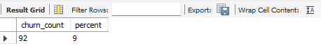

6. **What is the number and percentage of customer plans after their initial free trial?**
    ```sql
    -- Retrieving the number and percentage of customer plans after their initial free trial
    SELECT plan_name,
        ROUND(COUNT(DISTINCT s.customer_id), 0) AS customer_churn_count,
        ROUND((COUNT(DISTINCT s.customer_id) / (SELECT COUNT(DISTINCT customer_id) FROM subscriptions) * 100), 0) AS percentage_churned
    FROM subscriptions s
    JOIN plans p ON p.plan_id = s.plan_id
    WHERE p.plan_name != 'trial'
    GROUP BY plan_name;
    ```
Explanation: This query calculates the number and percentage of customer plans after their initial free trial.
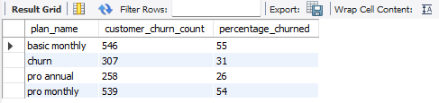   

7. **What is the customer count and percentage breakdown of all 5 plan_name values at 2020-12-31?**
   ```sql
	   -- Common Table Expression (CTE) to find the next start date for each subscription
	WITH cte_next_date AS (
	    SELECT *,
	        LEAD(start_date, 1) OVER(PARTITION BY customer_id ORDER BY start_date) AS next_date
	    FROM subscriptions
	    WHERE start_date <= '2020-12-31' -- Filter to include only subscriptions until December 31, 2020
	),
	
	-- CTE to calculate the breakdown of plan subscriptions
	plans_breakdown AS (
	    SELECT plan_id,
	        COUNT(DISTINCT customer_id) AS num_customer
	    FROM cte_next_date
	    WHERE (next_date IS NOT NULL AND (start_date < '2020-12-31' AND next_date > '2020-12-31'))
	        OR (next_date IS NULL AND start_date < '2020-12-31')
	    GROUP BY plan_id
	)
	
	-- Final query to calculate the percentage breakdown of plan subscriptions
	SELECT plan_id, num_customer,
	    ROUND(num_customer * 100 / (SELECT COUNT(DISTINCT customer_id) FROM subscriptions), 1) AS perc_customer
	FROM plans_breakdown
	GROUP BY plan_id, num_customer
	ORDER BY plan_id;
    ```
Explanation:
- The first CTE (cte_next_date) calculates the next start date for each subscription using the `LEAD` window function. It partitions the data by `customer_id` and orders it by `start_date`. It filters the subscriptions to include only those until December 31, 2020.
- The second CTE (plans_breakdown) calculates the breakdown of plan subscriptions. It counts the number of distinct customers for each plan_id based on specific conditions related to the next start date.
- The final query calculates the percentage breakdown of plan subscriptions by dividing the count of customers for each `plan_id` by the total count of distinct customers in the `subscriptions` table. The result is rounded to one decimal place. The GROUP BY clause ensures that each `plan_id` is grouped with its corresponding number of customers, and the result is ordered by `plan_id`.
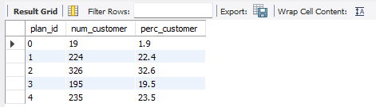

8. **How many customers have upgraded to an annual plan in 2020?**
    ```sql
    -- Counting the number of customers who have upgraded to an annual plan in 2020
    SELECT COUNT(DISTINCT s.customer_id) AS upgraded_customers
    FROM subscriptions s
    JOIN plans p ON p.plan_id = s.plan_id
    WHERE p.plan_name = 'pro annual' AND YEAR(s.start_date) = 2020;
    ```
Explanation: This query counts the number of customers who upgraded to an annual plan in the year 2020.
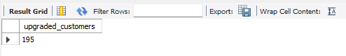

9. **How many days on average does it take for a customer to upgrade to an annual plan?**
    ```sql
    -- Selecting the average number of days it takes for customers to upgrade to an annual plan
    SELECT AVG(DATEDIFF(s.start_date, m.start_date)) AS average_days_to_upgrade
    FROM subscriptions s
    JOIN (
        SELECT customer_id, MIN(start_date) AS start_date
        FROM subscriptions
        GROUP BY customer_id
    ) AS m ON m.customer_id = s.customer_id
    JOIN plans p ON p.plan_id = s.plan_id
    WHERE p.plan_name = 'pro annual';
    ```
Explanation: This query calculates the average number of days for customers to upgrade to an annual plan.
- **Alternate Solution:**
  ```sql
	-- Common Table Expression (CTE) to find the start date of the trial and annual plans for each customer
	WITH plan_dates AS (
	    SELECT s.customer_id,
	        MIN(CASE WHEN p.plan_name = 'trial' THEN s.start_date END) AS trial_date,
	        MIN(CASE WHEN p.plan_name = 'pro annual' THEN s.start_date END) AS annual_date
	    FROM subscriptions s
	    JOIN plans p ON p.plan_id = s.plan_id
	    GROUP BY s.customer_id
	),
	-- Calculate the difference in days between the trial and annual plans for each customer
	day_period AS (
	    SELECT customer_id,
	        DATEDIFF(annual_date, trial_date) AS diff
	    FROM plan_dates
	    WHERE trial_date IS NOT NULL AND annual_date IS NOT NULL
	)
	-- Calculate the average number of days for customers to upgrade to an annual plan
	SELECT AVG(diff) AS average_days_to_upgrade
	FROM day_period;
    ```
  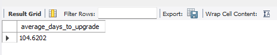
  
10. **Can you further breakdown this average value into 30 day periods (i.e. 0-30 days, 31-60
days etc)?**
    ```sql
	    -- Common Table Expression (CTE) to find the trial and annual plan dates for each customer
	    WITH plan_dates AS (
	        SELECT s.customer_id,
	            MIN(CASE WHEN p.plan_name = 'trial' THEN s.start_date END) AS trial_date,
	            MIN(CASE WHEN p.plan_name = 'pro annual' THEN s.start_date END) AS annual_date
	        FROM subscriptions s
	        JOIN plans p ON p.plan_id = s.plan_id
	        GROUP BY
	            s.customer_id
	    ),
	    -- Calculate the difference in days between the trial and annual plans for each customer
	    day_period AS (
	        SELECT customer_id, DATEDIFF(annual_date, trial_date) AS diff
	        FROM plan_dates
	        WHERE trial_date IS NOT NULL AND annual_date IS NOT NULL
	    ),
	    -- Bin the differences into 30-day periods
	    bins AS (
	        SELECT *, FLOOR(diff / 30) AS bin    
	        FROM day_period        
	    )
	    -- Count the number of customers in each 30-day period bin
	    SELECT
	        CONCAT((bin * 30) + 1, ' - ', (bin + 1) * 30, ' days') AS days,
	        COUNT(customer_id) AS total
	    FROM  bins
	    GROUP BY bin;
    ```
Explanation: 
    This SQL script uses Common Table Expressions (CTEs) to perform the following tasks:
    - **plan_dates CTE**: This CTE calculates the start dates of the trial and annual plans for each customer. It does this by joining the `subscriptions` table with the `plans` table and filtering based on plan 
            names ('trial' and 'pro annual'). The result is grouped by `customer_id`.
    - **day_period CTE**: After obtaining the start dates of trial and annual plans for each customer, this CTE calculates the difference in days between the start dates of the annual plan and the trial plan. It 
            filters out any records where either the trial_date or the annual_date is NULL.
    - **bins CTE**: This CTE bins the differences in days obtained from the `day_period` CTE into 30-day periods. It uses the `FLOOR` function to divide the differences by 30, thus assigning each difference to a 
           specific bin.
	
	Finally, the main query selects the bins, concatenates the 30-day periods, counts the number of customers in each bin, and groups the results by the bin. This provides insight into how many customers upgraded 
        from trial to annual plans within specific 30-day periods.
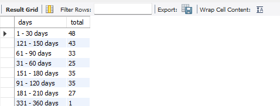
    
  11. **How many customers downgraded from a pro monthly to a basic monthly plan in 2020?**
      ```sql
		-- Selecting the count of customers who downgraded from 'pro monthly' to 'basic monthly' plan in 2020
		SELECT COUNT(s.customer_id) AS customers_downgraded
		
		-- From the subscriptions table, aliased as 's'
		FROM subscriptions s
		
		-- Joining the plans table to get information about the current plan
		JOIN plans current_plan ON current_plan.plan_id = s.plan_id
		
		-- Joining the plans table again to find the previous plan for each customer
		JOIN plans previous_plan ON previous_plan.plan_id = (
		    -- Subquery to find the previous plan based on the latest start date before the current subscription's start date
		    SELECT plan_id 
		    FROM subscriptions 
		    WHERE customer_id = s.customer_id 
		        AND start_date < s.start_date  -- Find subscriptions with start date before the current subscription's start date
		    ORDER BY start_date DESC  -- Order by start date in descending order to get the latest previous plan
		    LIMIT 1  -- Limiting to only the latest previous plan
		)
		
		-- Filtering the subscriptions to include only those started in 2020 with the current plan as 'basic monthly' and previous plan as 'pro monthly'
		WHERE YEAR(s.start_date) = 2020
		    AND current_plan.plan_name = 'basic monthly'
		    AND previous_plan.plan_name = 'pro monthly';
        ```
Explanation:  This SQL query counts customers who switched from a 'pro monthly' to a 'basic monthly' plan in 2020. It does so by joining the `subscriptions` table with the `plans` table twice to compare the current and previous plans for each customer. Then, it filters the data to include only those who downgraded and counts the number of distinct customer IDs meeting the criteria.

- **Alternate Solution:**
	```sql
		 WITH next_plan AS (
			SELECT*, 
                        LEAD(plan_id, 1) OVER(PARTITION BY customer_id ORDER BY start_date, plan_id) AS plan
			FROM subscriptions)
		SELECT
			COUNT(DISTINCT customer_id) AS num_downgrade
		FROM next_plan np
		LEFT JOIN plans p ON p.plan_id = np.plan_id
		WHERE p.plan_name = 'pro monthly' AND np.plan = 1 AND start_date <= '2020-12-31';
	   ```
 Explanation: This SQL query counts the number of customers who downgraded from a 'pro monthly' plan to another plan in the dataset up to December 31, 2020. It does so by using a window function to identify the next plan for each customer based on the start date and plan ID. Then, it joins this data with the `plans` table to filter for 'pro monthly' plans that were followed by a different plan. Finally, it counts the distinct customer IDs meeting these criteria.
 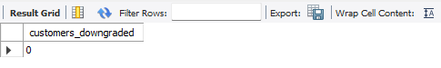
